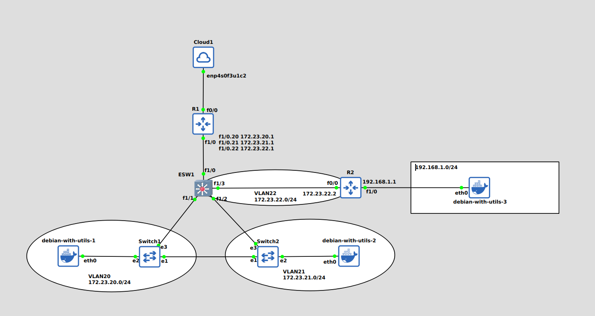
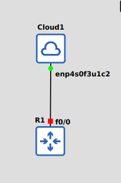
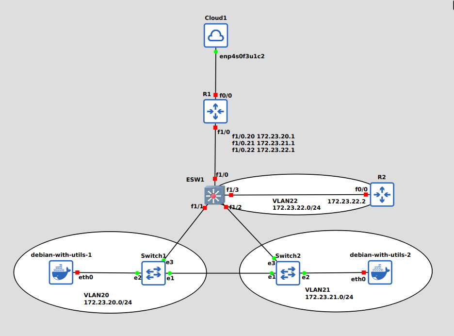

# GNS3 Computer Networks Final Project
This is a complete guide on how to implement this topology on GNS3 so that all hosts have access to the internet and can ping each other.



## Table of content
- [Router Setup](#router-setup)
- [Host Setup](#host-setup)
- [Connecting The First Router To The Internet](#connection-the-first-router-to-the-internet)
- [Adding VLANs](#adding-vlans)
- [Configuring Hosts Using DHCP](#configuring-hosts-using-dhcp)
- [Connecting The Routers To Each Other](#connection-the-first-router-to-the-internet)
- [NAT](#nat)
- [Adding The Third Host](#adding-the-third-host)
- [Nginx](#nginx)
## Router Setup
For this project I am using the c7200 as the router and c3725 as the ethernet switch.
The first step is to download the ios file for these routers which can be found on this [link](https://www.sysnettechsolutions.com/en/cisco-ios-download-for-gns3/).

To add the router into our project we need to open up GNS3 and the navigate to **edit > preferences** and then under **Dynamips** select **IOS routers**. Then it will ask us to give it the ios file, fill the network adapters slot and do some more configuration. The adapters we n
eed are the **Fast Ethernet Adapters** and the **Ethernet Adapters** which are labeled PA-FE-TX that will provide us a single 100 Mbps ethernet port and PA-4E which will give us 4 10 Mbps ethernet port.

Similarly to add the ethernet switch we need to do the same steps that we took to add the router but this time we need to check the "**This is an EtherSwitch router**" option.

## Host Setup

I have tested the VPCS and found that they don't work properly with DHCP (as discussed [here](https://www.gns3.com/community/support/cant-get-ip-address-from-dhcp-server)) and they have limited functionality, so in this project we ar going to use docker images instead.

Firstly we need to construct owr own docker image since the raw debian image doesn't have the tools that we need in our project preinstalled.

Here is the DockerFile
```DockerFile
FROM debian:latest
RUN apt-get update && apt-get install -y \
    iproute2 \
    iputils-ping \
    isc-dhcp-client \
    nano \
    && apt-get clean && rm -rf /var/lib/apt/lists/*
CMD ["bash"]
```
And then build the image with the following command
```console
$ docker build -t debian-with-utils .
```
To check if the image has been built you can use this command
```console
$ docker image ls
```
And you would get something like this.
```
REPOSITORY          TAG       IMAGE ID       CREATED       SIZE
debian-with-utils   latest    921c17d0e03b   3 days ago    139MB
debian              latest    11c49840db54   2 weeks ago   117MB
```
Then go head an open up GNS3 and navigate to **edit > preferences** and under **Docker** select **Docker containers**. After that click new and from there you can specify your docker image and give the number of ports for the host to have, for this project a single port will suffice.

## Connection The First Router To The Internet

For setting up the internet connection we need to use the cloud node in GNS3. first we need to drop the cloud node and our router on the screen and connect the router's f0/0 interface to the desired host machines's interface. Note that you shouldn't use the wifi interface since it won't work properly. If you don't see your desired interface double click on the cloud node and refresh to add the interface you're looking for. after these steps this will be the result.



Then go ahead and start up the router and double click to open the routers console.
You can examine the status of interfaces by using this command
```
R1# show ip interface brief
```

then you'll get something similar to this
```
FastEthernet0/0            unassigned      YES unset  administratively down down    
FastEthernet1/0            unassigned      YES unset  administratively down down    
FastEthernet2/0            unassigned      YES unset  administratively down down    
Ethernet3/0                unassigned      YES unset  administratively down down    
Ethernet3/1                unassigned      YES unset  administratively down down    
Ethernet3/2                unassigned      YES unset  administratively down down    
Ethernet3/3                unassigned      YES unset  administratively down down    
```

As you can see the f0/0 interface is down and our goal is to change the status to up and assign an IP to it so we can access the internet. First we have to enter the config mode using this command.
```
R1# configure terminal
```
then we have to select the f0/0 interface by entering this command.
```
R1(config)# interface f0/0
```
We can either manually assign IP to this port or use dhcp, in this project we'll use dhcp simply to make our life easier. We do this by using this command
```
R1(config-if)# ip address dhcp
```
And then we need to enable the port by entering this command
```
R1(config-if)# no shutdown
```
And to exit config mode we use the end command
```
R1(config-if)# end
```
After that the status for our interface would look like this
```
Interface                  IP-Address      OK? Method Status                Protocol
FastEthernet0/0            192.168.2.244   YES DHCP   up                    up      
FastEthernet1/0            unassigned      YES unset  administratively down down    
FastEthernet2/0            unassigned      YES unset  administratively down down    
Ethernet3/0                unassigned      YES unset  administratively down down    
Ethernet3/1                unassigned      YES unset  administratively down down    
Ethernet3/2                unassigned      YES unset  administratively down down    
Ethernet3/3                unassigned      YES unset  administratively down down 
```
We can now the the internet connection by pinging 8.8.8.8 and if every thing is okay we will see this.
```
R1# ping 8.8.8.8

Type escape sequence to abort.
Sending 5, 100-byte ICMP Echos to 8.8.8.8, timeout is 2 seconds:
!!!!!
Success rate is 100 percent (5/5), round-trip min/avg/max = 52/57/60 ms
```
But still we can't ping google.com since we haven't configured the DNS yet. to configure the DNS we need to enter config mode again and from there enter these commands.
```
R1(config)# ip domain-lookup
R1(config)# ip name-server 8.8.8.8
R1(config)# end
``` 
Then we can ping google.com
```
R1# ping google.com

Translating "google.com"...domain server (192.168.2.222) [OK]

Type escape sequence to abort.
Sending 5, 100-byte ICMP Echos to 216.239.38.120, timeout is 2 seconds:
!!!!!
Success rate is 100 percent (5/5), round-trip min/avg/max = 40/57/88 ms
```
At end run this command to save the configurations
```
R1# write memory
```

## Adding VLANs
Now we will add these three VLANs to our topology like so.



Firstly we need to configure the VLANs on the ESW1's ports to do this we'll use these commands.<br>
For VLAN 20
```
ESW1# configure terminal
ESW1(config)# interface f1/1
ESW1(config-if)# switchport mode access
ESW1(config-if)# switchport access vlan 20
```
And for VLAN 21
```
ESW1(config-if)# interface f1/2
ESW1(config-if)# switchport mode access
ESW1(config-if)# switchport access vlan 21
```
Similarly for VLAN 22
```
ESW1(config-if)# interface f1/3
ESW1(config-if)# switchport mode access
ESW1(config-if)# switchport access vlan 22
```
We can check the states of the VLANs with this command
```
ESW1# show vlan-switch brief
VLAN Name                             Status    Ports
---- -------------------------------- --------- -------------------------------
1    default                          active    Fa1/4, Fa1/5, Fa1/6, Fa1/7
                                                Fa1/8, Fa1/9, Fa1/10, Fa1/11
                                                Fa1/12, Fa1/13, Fa1/14, Fa1/15
20   VLAN0020                         active    Fa1/1
21   VLAN0021                         active    Fa1/2
22   VLAN0022                         active    Fa1/3
1002 fddi-default                     act/unsup 
1003 token-ring-default               act/unsup 
1004 fddinet-default                  act/unsup 
1005 trnet-default                    act/unsup 
```
You will see that the f1/1 is mapped to VLAN 20, f1/2 to VLAN 21 and f1/3 to VLAN1/3 as expected. 

Finally we will define a trunk port on f1/0 so the hosts on each VLAN can communicate witch each other through thr R1 router.
```
ESW1(config-if)# interface f1/0
ESW1(config-if)# switchport trunk encapsulation dot1Q
ESW1(config-if)# switchport trunk allowed vlan 1-2,20-22,1002-1005
ESW1(config-if)# switchport mode trunk
ESW1(config-if)# end
ESW1# write memory
```
Check the status of the interfaces with this command.
```
ESW1#show interface status

Port    Name               Status       Vlan       Duplex Speed Type
Fa1/0                      connected    trunk        full     100 10/100BaseTX
Fa1/1                      connected    20           full     100 10/100BaseTX
Fa1/2                      connected    21           full     100 10/100BaseTX
Fa1/3                      connected    22           full     100 10/100BaseTX
Fa1/4                      notconnect   1            auto    auto 10/100BaseTX
Fa1/5                      notconnect   1            auto    auto 10/100BaseTX
Fa1/6                      notconnect   1            auto    auto 10/100BaseTX
Fa1/7                      notconnect   1            auto    auto 10/100BaseTX
Fa1/8                      notconnect   1            auto    auto 10/100BaseTX
Fa1/9                      notconnect   1            auto    auto 10/100BaseTX
Fa1/10                     notconnect   1            auto    auto 10/100BaseTX
Fa1/11                     notconnect   1            auto    auto 10/100BaseTX
Fa1/12                     notconnect   1            auto    auto 10/100BaseTX
Fa1/13                     notconnect   1            auto    auto 10/100BaseTX
Fa1/14                     notconnect   1            auto    auto 10/100BaseTX
Fa1/15                     notconnect   1            auto    auto 10/100BaseTX
``` 

Now we have to define three sub-interfaces on the R1 router's f1/0 so that it could be used as the default gateway for each of the VLANs. Firstly we need to enable the f1/0 interface.

```
R1# configure terminal
R1(config)# interface f1/0
R1(config-if)# no shutdown
```

Then we will create the f1/0.20 sub-interface for the default gateway of VLAN 20 and assign it the IP address of 172.23.20.1
```
R1(config-if)# interface f1/0.20
R1(config-subif)# encapsulation dot1Q 20
R1(config-subif)# ip address 172.23.20.1 255.255.255.0
```
We do the same for VLAN 21.
```
R1(config-subif)# interface f1/0.21
R1(config-subif)# encapsulation dot1Q 21
R1(config-subif)# ip add 172.23.21.1 255.255.255.0
```
And for VLAN 22.
```
R1(config-subif)# interface f1/0.22
R1(config-subif)# encapsulation dot1Q 22
R1(config-subif)# ip add 172.23.22.1 255.255.255.0
```
At the end we will save our configuration.
```
R1(config-subif)# end
R1# write memory
```

## Configuring Hosts Using DHCP

Now that we have configured the VLANs we need to assign the hosts on these VLANs an IP address so that they can communicate with each other. To do this we will use the R1 router as the DHCP server.

We will define an IP pool named VLAN20 and give it the network address of 172.23.20.0/24 and the default gate way of 172.23.20.1 which is the IP address for the sub-interface on R1's f1/0 that we have previously configured. And finally add the google's DNS server (8.8.8.8) so that any host configured with DHCP will use this DNS server.   
```
R1(config)# ip dhcp pool VLAN20
R1(dhcp-config)# network 172.23.20.0 255.255.255.0
R1(dhcp-config)# default-router 172.23.20.1 
R1(dhcp-config)# dns-server 8.8.8.8
R1(dhcp-config)# exit
```
Similarly for VLAN 21
```
R1(config)# ip dhcp pool VLAN21
R1(dhcp-config)# network 172.23.21.0 255.255.255.0
R1(dhcp-config)# default-router 172.23.21.1
R1(dhcp-config)# dns-server 8.8.8.8
R1(dhcp-config)# exit
```
We will not define DHCP for VLAN 22 since we'll assign ip addresses manually to the routers on this VLAN.

And finally save the configuration.
```
R1# write memory 
```

Now we can go ahead and open up the hosts and get an IP address for them using DHCP. To get an IP address we can use this command on our host.
```console
$ dhclient
```
To see the assigned IP address to our host we can use this command
```console
$ ip address show dev eth0 | grep -w inet
```
The result will be this
```
inet 172.23.20.2/24 brd 172.23.20.255 scope global dynamic eth0
```
I've ran these command on the host residing in VLAN 20 and as you can see it gave us an address in the 172.23.20.0/24 address space.

After doing the same thing on the other host we are now able to ping each host from another.

```console
$ ping 172.23.21.2
PING 172.23.21.2 (172.23.21.2) 56(84) bytes of data.
64 bytes from 172.23.21.2: icmp_seq=1 ttl=63 time=31.6 ms
64 bytes from 172.23.21.2: icmp_seq=2 ttl=63 time=17.3 ms
64 bytes from 172.23.21.2: icmp_seq=3 ttl=63 time=13.6 ms
64 bytes from 172.23.21.2: icmp_seq=4 ttl=63 time=18.4 ms
```

## Connecting The Routers To Each Other
Firstly the R2 router needs to be assigned an IP address.

```
R2(config)# interface f0/0                        
R2(config-if)# ip address 172.23.22.2 255.255.255.0
R2(config-if)# no shutdown
R2(config-if)# end
```
And now R2 can be pinged from R1 and vice versa
```
R1# ping 172.23.22.2

Type escape sequence to abort.
Sending 5, 100-byte ICMP Echos to 172.23.22.2, timeout is 2 seconds:
.!!!!
Success rate is 80 percent (4/5), round-trip min/avg/max = 20/24/28 ms
``` 

Now we need to establish connection between the two routers. To do so we need to add an routing protocol (we'll use **OSPF**) to these routers so that they can discover each other and advertise/learn routes

```
R2(config)# router ospf 1
R2(config-router)# network 172.23.22.0 0.0.0.255 area 0
R2(config-router)# default-information originate 
R2(config-router)# end
R2# write memory
```
And for R1
```
R1(config)# router ospf 1
R1(config-router)# network 172.23.22.0 0.0.0.255 area 0
R1(config-router)# default-information originate
```

And now we can ping the second router from any host
```console
$ ping 172.23.22.2
PING 172.23.22.2 (172.23.22.2) 56(84) bytes of data.
64 bytes from 172.23.22.2: icmp_seq=1 ttl=254 time=19.3 ms
64 bytes from 172.23.22.2: icmp_seq=2 ttl=254 time=12.5 ms
64 bytes from 172.23.22.2: icmp_seq=3 ttl=254 time=31.0 ms
64 bytes from 172.23.22.2: icmp_seq=4 ttl=254 time=28.5 ms
```
## NAT
Since all the addressed we are dealing with here are private addresses we need to configure NAT for our router in order to have access to the internet. To do this we open up the console on R1 and do the following steps.

First we need to define the outside of the NAT.
```
R1# configure terminal
R1(config)# interface f0/0
R1(config-if)# ip nat outside
```
This means that the for the outgoing datagrams the source address will be replaced by the address of interface f0/0.

Then we need to define the inside of the NAT.
```
R1(config-if)# interface f1/0.20
R1(config-if)# ip nat inside
R1(config-if)# interface f1/0.21
R1(config-if)# ip nat inside
R1(config-if)# interface f1/0.22
R1(config-if)# ip nat inside
R1(config-if)# exit
```
Now we need to provide the list of addresses that need to be translated to the public address.
```
R1(config)# ip nat inside source list 1 interface f0/0 overload
R1(config)# access-list 1 permit 172.23.20.0 0.0.0.255
R1(config)# access-list 1 permit 172.23.21.0 0.0.0.255
R1(config)# end
R1# write memory
```
Now that NAT is configured we can now access internet from our hosts.
```console
$ ping google.com
PING google.com (216.239.38.120) 56(84) bytes of data.
64 bytes from any-in-2678.1e100.net (216.239.38.120): icmp_seq=1 ttl=50 time=90.2 ms
64 bytes from any-in-2678.1e100.net (216.239.38.120): icmp_seq=2 ttl=50 time=75.6 ms
64 bytes from any-in-2678.1e100.net (216.239.38.120): icmp_seq=3 ttl=50 time=71.8 ms
64 bytes from any-in-2678.1e100.net (216.239.38.120): icmp_seq=4 ttl=50 time=72.3 ms
```
## Adding The Third Host

Now let's add the third host connecting it to the network through R2.


Now we assign IP address of 192.168.1.1 to f1/0 on R2 and define a DHCP IP pool so that hosts on 192.168.1.0/24 would get assigned an IP address automatically.
```
R2(config)# interface f1/0
R2(config-if)# ip address 192.168.1.1 255.255.255.0
R2(config-if)# no shutdown
R2(config-if)# ip dhcp pool LAN 
R2(dhcp-config)# network 192.168.1.0 255.255.255.0
R2(dhcp-config)# dns-server 8.8.8.8
R2(dhcp-config)# default-router 192.168.1.1
```
We now add this new network to OSPF
```
R2(config)# router ospf 1
R2(config-router)# network 192.168.1.0 0.0.0.255 area 0
```
Now we assign an IP address on host 3 using `dhclient` command. If you have done the steps until here correctly every host on your network should be able to ping each other.

Now that we have connection between every host we only need to give internet access to host 3, to do so we'll add the network 192.168.1.0/24 to NAT on R1 so these IP ranges would also get translated.

```
R1(config)# access-list 1 permit 192.168.1.0 0.0.0.255 
```
And finally we can now access the internet on host 3.
```console
$ ping google.com
PING google.com (216.239.38.120) 56(84) bytes of data.
64 bytes from any-in-2678.1e100.net (216.239.38.120): icmp_seq=1 ttl=108 time=90.4 ms
64 bytes from any-in-2678.1e100.net (216.239.38.120): icmp_seq=2 ttl=108 time=78.1 ms
64 bytes from any-in-2678.1e100.net (216.239.38.120): icmp_seq=3 ttl=108 time=86.4 ms
64 bytes from any-in-2678.1e100.net (216.239.38.120): icmp_seq=4 ttl=108 time=75.0 ms
```
## Nginx

Now that we have internet access and hosts are connected to each other we can now go ahead and run our **Nginx** server on host 3. Since we have internet access we can download **Nginx** on the host using apt.

```console
$ apt update
$ apt install nginx
```
Now get he Nginx server up and running.
```console
$ nginx
```
Now on one of the hosts on the VLANs download **curl**.
```console
$ apt update
$ apt install curl
```
Now use **curl** to download the web page hosted on host 3
```console
$ curl 192.168.1.2
```
The result should be this
```html
<!DOCTYPE html>
<html>
<head>
<title>Welcome to nginx!</title>
<style>
html { color-scheme: light dark; }
body { width: 35em; margin: 0 auto;
font-family: Tahoma, Verdana, Arial, sans-serif; }
</style>
</head>
<body>
<h1>Welcome to nginx!</h1>
<p>If you see this page, the nginx web server is successfully installed and
working. Further configuration is required.</p>

<p>For online documentation and support please refer to
<a href="http://nginx.org/">nginx.org</a>.<br/>
Commercial support is available at
<a href="http://nginx.com/">nginx.com</a>.</p>

<p><em>Thank you for using nginx.</em></p>
</body>
</html>
```


